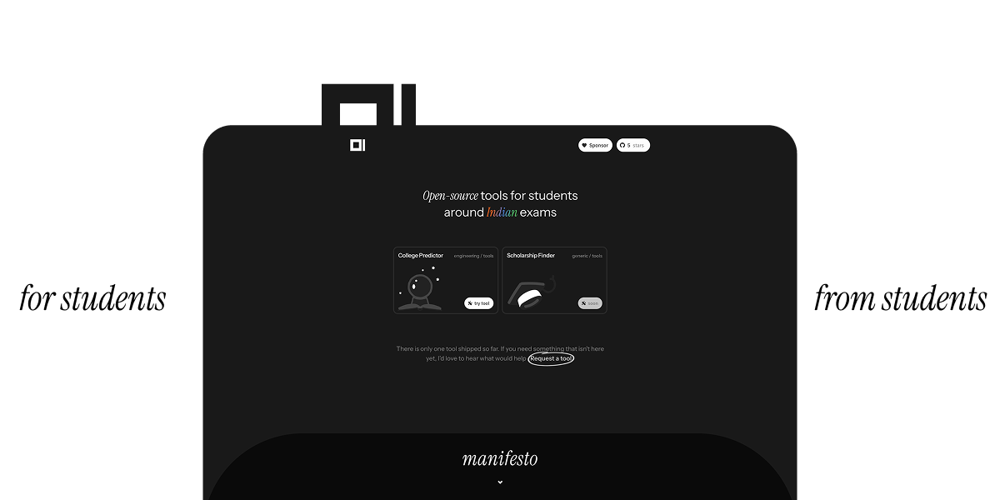
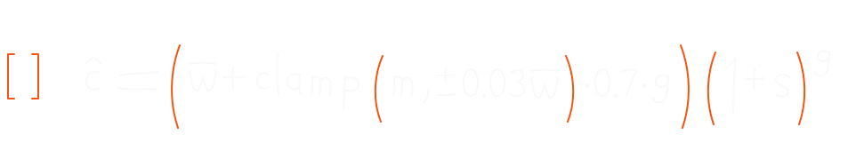
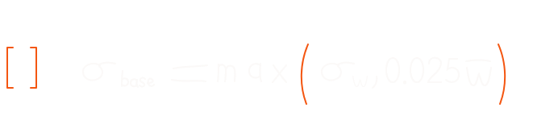
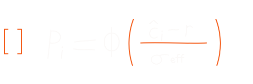
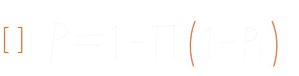
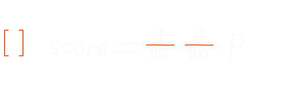
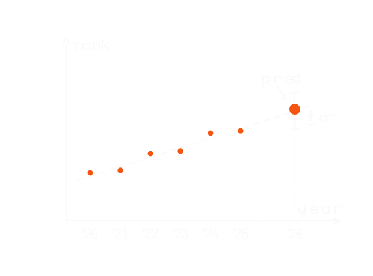
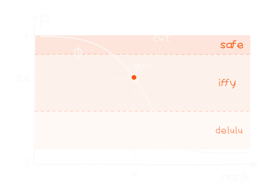
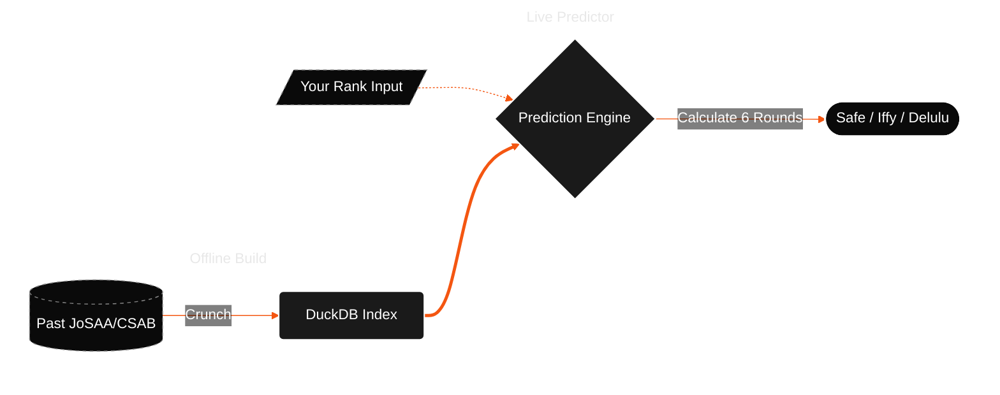
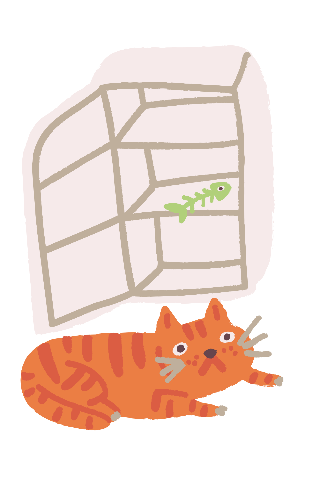

  

---

  <a href="docs/README.md">Documentation</a>
  ·
  <a href="CONTRIBUTING.md">Contributing</a>
  ·
  <a href="LICENSE">License</a>
  ·
  <a href="NOTICE">Notice</a>

 

  

 

## rant (#`^´)／

Every tool for students online somehow manages to suck. Closed-source. Ads everywhere. "Buy this." "Buy that." Yeah buddy... no thank you.

And then comes the data collection. Like...

**Alakh sir, do you really need my date of birth, phone-number, rank?**

Papa mummy ka bhi DOB dedu? Time of birth bhi chahiye kya? Blood group? Aadhaar bhi le lo sir. 😭

 

*oh my fucking god.* these sites squeeze students because they can. So tried to built what I wish existed.
 

**For students. From students.**

   

## tools (˶˃ ᵕ ˂˶) .ᐟ.ᐟ

  <code>ejam</code> / <code>tools</code> / <code>college predictor</code>

 

A college predictor. It takes years of past JoSAA and CSAB closing ranks to estimate what you might actually get. Just a simple tool to save you some headache during counselling. (Will try to add more exams soon, but for now it's just JEE).

 

### how it works?

two stages. first we chew through years of counselling data offline (duckdb, so the site stays fast). then when you type your rank, the live bit just reads that index and scores every seat.

 

  
  &nbsp;&nbsp;
  

 

ok so basically... we already did the heavy lifting offline. took years of josaa/csab cutoffs, weighted recent years higher, trimmed out the covid outliers, and accounted for ranks drifting ~3% every year like they always do.

[**[1]**](docs/college-predictor/nerd-stuff/index-algorithms.md#predicted-closing-rank) is just "where do we think it'll close this year". [**[2]**](docs/college-predictor/nerd-stuff/index-algorithms.md#sigma-floor) is "uhh how wrong could we be". if the old data looks weird we leave more space.

 

  
  &nbsp;&nbsp;
  
  &nbsp;&nbsp;
  

 

now you enter your rank. [**[3]**](docs/college-predictor/nerd-stuff/prediction-engine.md#single-round-probability) is like... for one round, what's your chance. better rank = higher P.

but counselling has ~6 rounds. so [**[4]**](docs/college-predictor/nerd-stuff/prediction-engine.md#round-by-round-cumulative-chance) adds them up. didn't get it in round 1? maybe round 6 still works.

and please don't flex 99% on a branch nobody wants. so [**[5]**](docs/college-predictor/nerd-stuff/balanced-ranking.md#composite-formula) looks at the college and the branch too. a good nit at 70% should beat some random place at 95%.

 

  
  &nbsp;&nbsp;
  

 

to summarize up, look at the graphs. left shows how past cutoffs turn into this year's **pred**, with the ±σ whisker for uncertainty. right shows your rank r on the chance curve pull across for P, and **Safe** / **Iffy** / **Delulu** are just labels for that number.

 

### TL;DR

 

  <a href="docs/README.md"><code><b>Read the full documentation ↗</b></code></a>

   

## credits [^._.^]ﾉ彡

  Dashboard layout adapted from <a href="https://efferd.com/">Efferd</a> by <a href="https://x.com/shabanhr">Shaban</a> 
  Charts adapted from <a href="https://evilcharts.com/">EvilCharts</a> by <a href="https://x.com/legionsdev">Gurbinder</a> 
  A few illustrations from <a href="https://icons8.com/">Icons8</a>

   

## sponsors /ᐠ. ｡.ᐟ\ᵐᵉᵒʷˎˊ˗

  

Hosting servers and crunching this much data isn't exactly free. If you found these tools useful and want to help keep it running, consider sponsoring. sponsorships go directly toward covering server costs and keeping the site completely ad-free.

  <a href="https://github.com/sponsors/su6u"><code><b>Sponsor the project 💖</b></code></a>

   

  <strong>→ <a href="docs/README.md">Documentation</a></strong>
  ·
  <strong><a href="https://ejam.in/college-predictor">Try College Predictor</a></strong>
  ·
  <strong><a href="https://github.com/su6u/ejam/issues/new?labels=tool-request&title=Tool+request%3A+&body=%23%23+Tool+name%0A%3C%21--+e.g.+NEET+college+predictor+--%3E%0A%0A%0A%23%23+What+should+it+do%3F%0A%3C%21--+What+problem+would+it+solve%3F+A+few+sentences+is+enough.+--%3E%0A%0A%0A%23%23+Who+is+it+for%3F%0A%3C%21--+e.g.+JEE+Main%2C+NEET+UG%2C+counselling+season+--%3E%0A%0A%0A%23%23+Anything+else%3F+%28optional%29%0A%3C%21--+Links%2C+screenshots%2C+or+similar+tools+you+like+--%3E%0A">Request a tool</a></strong>

