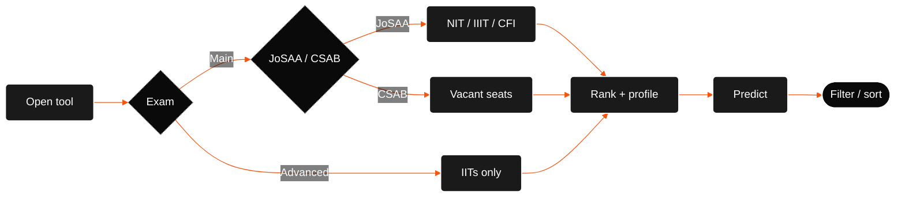

| body | when | institutes |
| --- | --- | --- |
| **JoSAA** | after Main / Advanced | IITs (Advanced rank), NITs, IIITs, GFTIs |
| **CSAB** | after JoSAA, vacant seats | NIT+, IIIT, CFI; separate cutoffs |

JoSAA runs up to **six rounds**. at NITs, **HS** / **OS** depends on domicile vs institute state. allotment uses **counselling rank**, not percentile.

## exam routing

## steps

1. **open** `/college-predictor` (or the tools grid). share links with predictor params land here too.
2. **pick exam**
   - **JEE Main** → JoSAA (main rounds) or CSAB (vacant seats). NITs, IIITs, CFI.
   - **JEE Advanced** → IITs only. quota / home-state fields stay hidden (All India).
3. **rank + profile**
   - **rank:** counselling integer (not percentile / marks). caps: **500,000** Main/CSAB, **50,000** Advanced. [why](../faqs/faqs.md#what-are-the-rank-limits)
   - **category:** General, Gen-EWS, OBC-NCL, SC, ST
   - **gender:** Neutral or Female
   - Main also needs **quota** (OS / HS / AI), **counselling** (JoSAA / CSAB), and **home state** for OS/HS
4. **predict.** click **Predict colleges**. inputs sync to the URL. complete URL on load auto-runs (`rank`, `exam`, `counselling`, `category`, `gender`, `quota`, `state`, `ews`, `include_all`).
5. **filter / sort.** sidebar: institute type, band, long-shot toggle. table: Balanced, Best chance, Closing rank, Institute. click a row for round detail.

## next

| guide | what |
| --- | --- |
| [what you need to know](what-you-need-to-know.md) | rank, category, quota, GFTI vs CFI |
| [how it works](../how-it-works/overview.md) | under the hood |
| [from rank to results](../how-it-works/from-rank-to-results.md) | bands, chance, closing rank |
