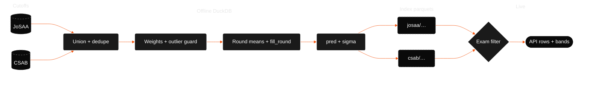
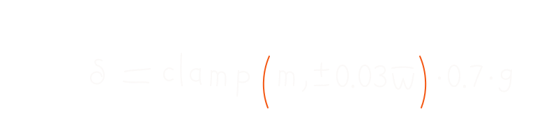
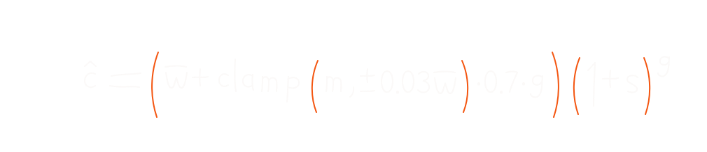
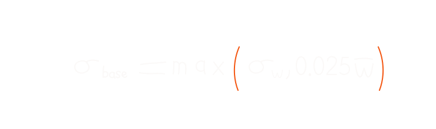

# index algorithms

the predictor index is built offline with DuckDB. each builder reads cutoff parquets, aggregates years of history, and writes one parquet the live API loads.

two algorithms on purpose:

- **`jam-josaa-v3`** for JoSAA cutoffs (JEE Main + JEE Advanced). **production**
- **`jam-csab-v2`** for CSAB cutoffs (supplementary counselling)

> **`jam-josaa-v2` is deprecated** (2026-06). replaced by v3: +3%/yr pool shift and softer round weights. see [jam-josaa-v3](#jam-josaa-v3-josaa) and [deprecated: jam-josaa-v2](#deprecated-jam-josaa-v2).

## data flow



## shared preprocessing

both builders:

1. union all cutoff parquet files.
2. cap rounds above 6 into round 6.
3. rewrite raw `3IT` institute type to canonical `IIIT`.
4. dedupe: keep the **max** closing rank per program, year, and round (worst closing rank wins ties).
5. year weights with a COVID-style **outlier guard**: if a year's closing rank is more than `2.5 * sigma_inter` away from the median of other years in the window, that year's weight drops to `0.01`.
6. per-round weighted means for the round trajectory columns.
7. `fill_round` as a weighted average of each year's last round with data.
8. sigma floor (see below).
9. inflate `sigma_eff ← 1.5 * sigma_base` when years of data is below 3.

data quality labels:

| years of history | label |
| --- | --- |
| 1 | `pooled` |
| 2 | `inferred` |
| 3+ | `sufficient` |

## jam-josaa-v3 (JoSAA)

**source:** `data/datasets/engineering/jee/josaa/cutoffs/`

**output:** `data/tools/college-predictor/josaa/predictor-index.parquet`

### anchor closing rank per year

before year-level stats, each year gets one anchor closing rank. rounds inside that year are combined with fixed weights (later rounds dominate more than v2):

| round | weight |
| --- | --- |
| 1 | 0.01 |
| 2 | 0.02 |
| 3 | 0.05 |
| 4 | 0.10 |
| 5 | 0.22 |
| 6 | 0.60 |

later rounds count more because that's where seats actually settled. v3 shifts weight toward the final round (R6) compared to v2.

### year weights (4-year window)

most recent year first:

| recency (`yr`) | year weight |
| --- | --- |
| 1 (latest) | 0.50 |
| 2 | 0.30 |
| 3 | 0.15 |
| 4 | 0.05 |

<p align="center">
  
</p>

### weighted statistics

from the anchor series:

- **`weighted_mean`**: weighted average closing rank
- **`weighted_std`**: weighted standard deviation
- **`trend_slope`**: weighted linear regression slope (rank change per year)

### predicted closing rank

let `g = prediction_year - last_data_year`.

trend is capped to ±3% of `weighted_mean` per year, then scaled by `0.7` before applying the gap:

<p align="center">
  
</p>

<p align="center">
  
</p>

`m` = `trend_slope`, `w_bar` = `weighted_mean`, `s` = pool shift.

**pool shift** models rank inflation as more candidates appear. production default **+3% per year** (`JAM_POOL_SHIFT_PCT` in `config.ts`, mirrored in `nta-pool-stats.json`). literal year-on-year unique appeared growth (~4.3% for 2025→2026) was backtested but not used as-is; it may overshoot. override: `EJAM_POOL_SHIFT_PCT`.

**prediction year** defaults to calendar year. override: `EJAM_PREDICTION_YEAR`.

same formula in SQL:

```sql
ROUND(
  (weighted_mean + capped_trend * 0.7 * gap)
  * POWER(1 + pool_shift, gap)
)
```

### sigma floor

<p align="center">
  
</p>

uncertainty scales with how high the typical cutoff rank is, instead of a flat ±50 for everyone.

### walk-forward backtest (2023–2025 avg)

| config | avg ±20% | worst year ±20% |
| --- | --- | --- |
| **v3 (wf-rw-soft-p30)** | **72.3%** | **69.9%** |
| v2 baseline | 70.8% | 69.8% |

2025 holdout alone: v3 reaches ~73.9% ±20% vs v2 ~72.8%.

## deprecated: jam-josaa-v2

> **do not use for new index builds.** retained in code as `JAM_JOSAA_V2` / `JAM_V2_*` constants for historical comparison only.

| change v2 → v3 | v2 (deprecated) | v3 (production) |
| --- | --- | --- |
| pool shift | +1%/yr | **+3%/yr** |
| round weights (R1…R6) | 5%, 8%, 12%, 15%, 22%, 38% | **1%, 2%, 5%, 10%, 22%, 60%** |
| all other hyperparams | unchanged | unchanged |

v2 anchor weights for reference:

| round | weight |
| --- | --- |
| 1 | 0.05 |
| 2 | 0.08 |
| 3 | 0.12 |
| 4 | 0.15 |
| 5 | 0.22 |
| 6 | 0.38 |

v2 pool shift default was +1%/yr from `nta-pool-stats.json`.

## jam-csab-v2 (CSAB)

**source:** `data/datasets/engineering/jee/csab/cutoffs/`

**output:** `data/tools/college-predictor/csab/predictor-index.parquet`

CSAB cutoffs are worse (numerically higher rank) than JoSAA late rounds because strong candidates already took JoSAA seats. CSAB stays in a separate index, not blended into JoSAA.

### differences from JoSAA

| aspect | JoSAA | CSAB |
| --- | --- | --- |
| year window | 4 years | 2 years |
| year weights | 0.50, 0.30, 0.15, 0.05 | 0.70, 0.30 |
| anchor series | round-weighted blend | last round of each year |
| pool shift | yes (+3%/yr default) | no |
| default `fill_round` | weighted from history | 2 |
| predicted rank | single formula | 50/50 ensemble of two profiles |

### blended mean (per profile)

each profile mixes weighted mean and median:

$$
\bar{w}_{\mathrm{blend}} = (1 - \beta)\,\bar{w} + \beta\,\tilde{w}
$$

$\beta$ = `median_blend`, $\tilde{w}$ = median. `median_blend` varies by institute type (`NIT`, `IIIT`, `CFI`). CFI gets a higher blend because CSAB CFI cutoffs are noisier.

### production ensemble

two profiles averaged 50/50:

1. **best-split** (default blends per instype)
2. **cap-cfi10** (tighter trend caps, especially for CFI at 10%)

$$
\hat{c} = \mathrm{round}\!\left(\frac{\hat{c}_a + \hat{c}_b}{2}\right)
$$

trend cap default ±6% of `w_bar` per year (instype-specific overrides in the cap profile). trend gap multiplier `1.0` (full gap, unlike JoSAA's `0.7`).

sigma floor for CSAB uses `0.03 * w_bar` instead of JoSAA's `0.025`.

## after the index loads

exam-specific predictors filter and enrich rows:

### JEE Main

drop IIT rows. attach state and program names from `institutes.json` / `programs.json`. filter by quota: HS (home state matches institute), OS (different state), AI (all), or special quotas (Goa, J&K, Ladakh, Andhra Pradesh) when passed via API.

seat type `Gen-EWS` from the category dropdown maps to index label `EWS`. optional `has_ews_certificate` (URL param `ews=true`) runs a second prediction pass on EWS seat rows for side-by-side OPEN vs EWS comparison.

### JEE Advanced

keep IIT rows only. quota fixed to AI.

### CSAB

load CSAB index only. same quota rules as JEE Main.
