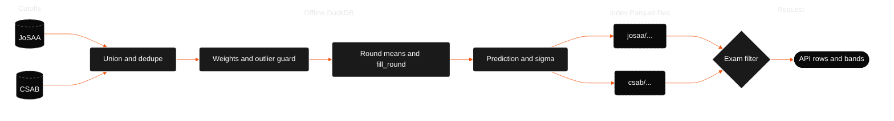

# Index algorithms

DuckDB builds the predictor indexes offline. Each builder reads cutoff Parquet files, aggregates historical data, and writes an index that the API can load.

The project uses two algorithms:

- **`jam-josaa-v3`** for JoSAA cutoffs from JEE Main and JEE Advanced. This is the production algorithm.
- **`jam-csab-v2`** for CSAB cutoffs.

`jam-josaa-v2` is deprecated since 2026-06. Version 3 adds a 3 percent annual pool shift and uses softer round weights. Read [the version 3 section](#jam-josaa-v3-josaa) and [the version 2 section](#deprecated-jam-josaa-v2) for details.

## Data flow



## Shared preprocessing

Both builders perform these steps:

1. Combine all cutoff Parquet files.
2. Assign rounds above 6 to round 6.
3. Map the raw `3IT` institute type to the canonical `IIIT` type.
4. Deduplicate each program, year, and round. Keep the maximum closing rank when duplicate rows conflict.
5. Apply a COVID-style outlier guard. If a year's closing rank is more than `2.5 * sigma_inter` from the median of the other years, reduce that year's weight to `0.01`.
6. Calculate weighted means for each round.
7. Calculate `fill_round` as the weighted average of the last round with data for each year.
8. Apply the sigma floor.
9. Set `sigma_eff` to `1.5 * sigma_base` when the history contains fewer than three years.

The data-quality labels are:

| Years of history | Label        |
| ---------------- | ------------ |
| 1                | `pooled`     |
| 2                | `inferred`   |
| 3 or more        | `sufficient` |

## `jam-josaa-v3` for JoSAA

**Source:** `data/datasets/engineering/jee/josaa/cutoffs/`

**Output:** `data/tools/college-predictor/josaa/predictor-index.parquet`

### Anchor closing rank by year

Each year receives one anchor closing rank before the year-level statistics run. The builder combines rounds with fixed weights.

| Round | Weight |
| ----- | ------ |
| 1     | 0.01   |
| 2     | 0.02   |
| 3     | 0.05   |
| 4     | 0.10   |
| 5     | 0.22   |
| 6     | 0.60   |

Later rounds have higher weights because they show where seats settle. Version 3 gives more weight to round 6 than version 2.

### Year weights

The builder uses a four-year window. The latest year has the highest weight.

| Recency (`yr`) | Year weight |
| -------------- | ----------- |
| 1              | 0.50        |
| 2              | 0.30        |
| 3              | 0.15        |
| 4              | 0.05        |

<p align="center">
  
</p>

### Weighted statistics

The builder calculates these values from the anchor series:

- **`weighted_mean`:** Weighted average closing rank.
- **`weighted_std`:** Weighted standard deviation.
- **`trend_slope`:** Weighted linear regression slope for rank change per year.

### Predicted closing rank

Let `g = prediction_year - last_data_year`.

The builder caps the trend at plus or minus 3 percent of `weighted_mean` per year. It then multiplies the trend by `0.7` before it applies the year gap.

<p align="center">
  
</p>

<p align="center">
  
</p>

`m` is `trend_slope`. `w_bar` is `weighted_mean`. `s` is the pool shift.

The production pool shift is plus 3 percent per year. `JAM_POOL_SHIFT_PCT` in `config.ts` and `nta-pool-stats.json` define the default. A measured year-over-year unique-candidate increase of about 4.3 percent from 2025 to 2026 was tested but is not used as the default. It can overestimate the shift. Set `EJAM_POOL_SHIFT_PCT` to override the default.

The prediction year defaults to the calendar year. Set `EJAM_PREDICTION_YEAR` to use another year.

The SQL form is:

```sql
ROUND(
  (weighted_mean + capped_trend * 0.7 * gap)
  * POWER(1 + pool_shift, gap)
)
```

### Sigma floor

<p align="center">
  
</p>

Uncertainty scales with the typical cutoff rank. It does not use one fixed value for every program.

### Walk-forward backtest, 2023 to 2025

| Configuration             | Average within 20 percent | Worst year within 20 percent |
| ------------------------- | ------------------------- | ---------------------------- |
| **v3 (`wf-rw-soft-p30`)** | **72.3%**                 | **69.9%**                    |
| v2 baseline               | 70.8%                     | 69.8%                        |

For the 2025 holdout alone, v3 reaches about 73.9 percent within 20 percent. Version 2 reaches about 72.8 percent.

## Deprecated: `jam-josaa-v2`

Do not use version 2 for new index builds. The code retains `JAM_JOSAA_V2` and `JAM_V2_*` constants for historical comparison.

| Change from v2 to v3    | v2                         | v3                            |
| ----------------------- | -------------------------- | ----------------------------- |
| Pool shift              | +1% per year               | **+3% per year**              |
| Round weights, R1 to R6 | 5%, 8%, 12%, 15%, 22%, 38% | **1%, 2%, 5%, 10%, 22%, 60%** |
| Other parameters        | Unchanged                  | Unchanged                     |

The version 2 anchor weights were:

| Round | Weight |
| ----- | ------ |
| 1     | 0.05   |
| 2     | 0.08   |
| 3     | 0.12   |
| 4     | 0.15   |
| 5     | 0.22   |
| 6     | 0.38   |

The version 2 pool shift default was plus 1 percent per year from `nta-pool-stats.json`.

## `jam-csab-v2` for CSAB

**Source:** `data/datasets/engineering/jee/csab/cutoffs/`

**Output:** `data/tools/college-predictor/csab/predictor-index.parquet`

CSAB closing ranks are usually numerically higher than late JoSAA closing ranks. Strong candidates may already hold JoSAA seats. CSAB therefore uses a separate index.

### Differences from JoSAA

| Aspect               | JoSAA                                   | CSAB                           |
| -------------------- | --------------------------------------- | ------------------------------ |
| Year window          | 4 years                                 | 2 years                        |
| Year weights         | 0.50, 0.30, 0.15, 0.05                  | 0.70, 0.30                     |
| Anchor series        | Round-weighted blend                    | Last round of each year        |
| Pool shift           | Yes, plus 3 percent per year by default | No                             |
| Default `fill_round` | Weighted from history                   | 2                              |
| Predicted rank       | Single formula                          | 50/50 ensemble of two profiles |

### Blended mean for each profile

Each profile combines the weighted mean and median:

$$
\bar{w}_{\mathrm{blend}} = (1 - \beta)\,\bar{w} + \beta\,\tilde{w}
$$

`beta` is `median_blend`. `w_tilde` is the median. `median_blend` varies by institute type. CFI uses a higher blend because CFI CSAB cutoffs have more variation.

### Production ensemble

The production index averages two profiles:

1. **best-split:** Uses institute-type-specific blends.
2. **cap-cfi10:** Uses tighter trend caps, especially for CFI at 10 percent.

$$
\hat{c} = \mathrm{round}\!\left(\frac{\hat{c}_a + \hat{c}_b}{2}\right)
$$

The default trend cap is plus or minus 6 percent of `w_bar` per year. The cap profile has institute-type overrides. The trend gap multiplier is `1.0`. JoSAA uses `0.7`.

The CSAB sigma floor uses `0.03 * w_bar`. JoSAA uses `0.025`.

## After the index loads

Exam-specific predictors filter and enrich the rows.

### JEE Main

The predictor removes IIT rows. It adds state and program names from `institutes.json` and `programs.json`. It filters quotas as follows:

- `HS`: Home state matches the institute state.
- `OS`: Home state differs from the institute state.
- `AI`: All India.
- Special quotas: Goa, J&K, Ladakh, and Andhra Pradesh when the API provides one.

The `Gen-EWS` category maps to the index label `EWS`. The optional `has_ews_certificate` value, represented by `ews=true`, runs a second prediction pass for EWS rows and displays the OPEN and EWS results together.

### JEE Advanced

The predictor keeps IIT rows and fixes the quota to `AI`.

### CSAB

The predictor loads the CSAB index and uses the same quota rules as JEE Main.
