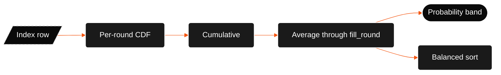

# Prediction engine

The index contains a predicted closing rank and an uncertainty value for each program. A request reads those values and calculates the probability for the submitted rank.

## Probability pipeline



## Single-round probability

For one counselling round:

<p align="center">
  
</p>

A lower student rank is better. When the submitted rank equals the predicted closing rank, the probability is about 50 percent.

`sigma_eff` is at least 1. This prevents division by zero. The index build derives it from historical spread. The build also applies a floor and increases uncertainty when the data is sparse.

The CDF uses Abramowitz and Stegun 7.1.26 for the error function. The maximum error is about `5e-5`.

```typescript
const sigma = Math.max(sigmaEffective, 1);
const z = (predictedClosingRank - studentRank) / sigma;
return normalCDF(z);
```

The predicted closing rank is the centre of the distribution. A better rank produces a probability above 50 percent. A worse rank produces a probability below 50 percent.

## Cumulative probability by round

JoSAA can run up to six rounds. CSAB usually has two rounds. The index stores one weighted closing-rank mean for each round and a `fill_round` value.

For each round through `fill_round`:

1. Calculate `P_i` from the round mean.
2. Add the round probability to the cumulative probability.

<p align="center">
  
</p>

The model treats rounds as independent opportunities. A student who does not reach a seat in round 1 can still reach it in a later round.

After `fill_round`, later slots keep the last cumulative value. The model does not create extra rounds.

The headline probability is the average of the cumulative values from round 1 through `fill_round`.

<p align="center">
  
</p>

```typescript
const activeProbs = roundProbs.slice(0, fillRound);
return sum(activeProbs) / activeProbs.length;
```

The interface shows all six round slots. Select a bar to view that round's cumulative probability.

## Probability labels

The thresholds are fixed in code. The internal keys remain stable for API compatibility.

| Display label     | Internal key    | Threshold          |
| ----------------- | --------------- | ------------------ |
| **Likely**        | `safe`          | `P >= 0.85`        |
| **Possible**      | `iffy`          | `0.40 <= P < 0.85` |
| **Unlikely**      | `delulu`        | `0.10 <= P < 0.40` |
| **Very unlikely** | `doesnt-matter` | `P < 0.10`         |

Programs below 10 percent are hidden by default. Select **Show very unlikely results** or pass `include_all=true` in the URL or API request.

## Default order

The API sorts by probability band first. The order is Likely, Possible, Unlikely, and Very unlikely. Within a band, the API places the lower predicted closing rank first.

The interface uses the balanced score by default. Read [Balanced ranking](balanced-ranking.md) for the score details.

## Limits of the engine

- The engine does not use live seat-matrix or vacancy counts.
- The engine does not simulate choice filling or float decisions.
- The engine uses rank and category inputs to match index rows. It does not use board marks or bonus points.
