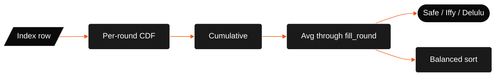
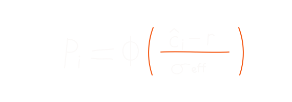
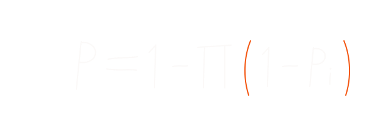

# prediction engine

once the index row exists, runtime is just math. no ML at request time. each program already has a predicted closing rank and an uncertainty width; your rank plugs into a normal curve.

## probability pipeline



## single-round probability

for one counselling round:

<p align="center">
  
</p>

lower student rank = better. when `r` equals the predicted close, chance is about 50%.

`sigma_eff` is at least 1 so we never divide by zero. it comes from the index build (historical spread, with floors and a bump when data is thin).

CDF uses Abramowitz and Stegun 7.1.26 for erf. max error around `5e-5`, fine for display %.

```typescript
const sigma = Math.max(sigmaEffective, 1);
const z = (predictedClosingRank - studentRank) / sigma;
return normalCDF(z);
```

intuition: predicted close is the centre of a bell. better than centre → above 50%. worse → below.

## round-by-round cumulative chance

JoSAA runs up to six rounds. CSAB usually stops at two. the index stores a weighted mean closing rank per round (`round1_mean` … `round6_mean`) plus `fill_round` (typical last round where seats actually fill).

for each round `i` up to `fill_round`:

1. compute single-round `P_i` from that round's mean.
2. stack into cumulative chance:

<p align="center">
  
</p>

rounds are treated as independent shots: miss round 1, still have round 2, and so on.

after `fill_round`, later slots freeze at the last cumulative value (no fake extra rounds).

the headline number on each row is the **average** of those cumulatives from round 1 through `fill_round`, not just the last round:

<p align="center">
  
</p>

```typescript
const activeProbs = roundProbs.slice(0, fillRound);
return sum(activeProbs) / activeProbs.length;
```

the UI bar chart shows all six slots. hover a bar for that round's cumulative. the % beside the bars is the average above.

## band labels

fixed thresholds in code:

| band | threshold |
| --- | --- |
| **safe** | P ≥ 0.85 |
| **iffy** | 0.40 ≤ P < 0.85 |
| **delulu** | 0.10 ≤ P < 0.40 |
| **doesn't matter yaar** | P < 0.10 |

programs below 10% are hidden by default. flip **Doesn't matter yaar → Show** in the UI, or pass `include_all=true` (URL / API).

## default ordering (before sort picker)

API sorts by band first (safe → iffy → delulu → doesn't matter yaar). inside a band, lower `predicted_closing_rank` first (more competitive).

UI default is **balanced**, which reorders with institute + branch scores ([balanced ranking](balanced-ranking.md)).

## what the engine does not do

- **seat matrix / vacancy counts.** cutoff history only. live vacant seats during counselling are not folded in.
- **choice filling / float logic.** no simulation of what happens if a higher choice is picked elsewhere.
- **board marks / bonus points.** only rank (and category inputs) for matching index rows.
